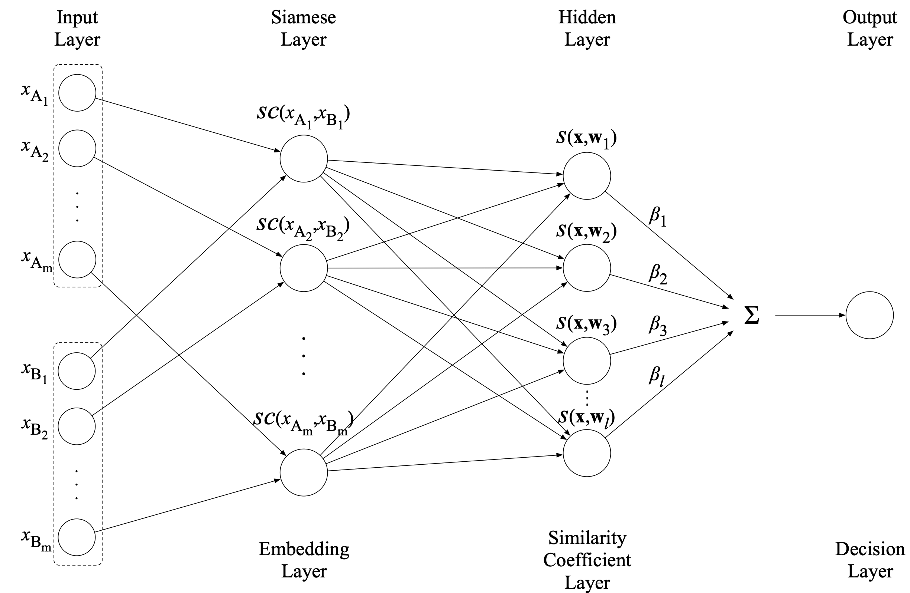

# Siamese Extreme Learning Machine (SELM)

**_Wasu Kudisthalert, Kitsuchart Pasupa, Aythami Morales, & Julian Fierrez_**



## Files
- anchor_features.csv > data samples (X_{A})
- compared_features.csv > data samples (X_{B})
- labels.csv > data labels
- pairing_id.csv > data ID
- run_script.py > use this file to demonstrate the SELM
- selm.py > SELM method

## Citation
If this work is helpful in your research, please cite and star:

```bibtex
@article{KudisthalertPasupaMoralesFierrez:2022,
	author = {Kudisthalert, Wasu and Pasupa, Kitsuchart and Morales, Aythami and Fierrez, Julian},
	doi = {10.1007/s00521-022-07100-z},
	isbn = {1433-3058},
	journal = {Neural Computing and Applications},
	title = {{SELM}: Siamese extreme learning machine with application to face biometrics},
	ty = {JOUR},
	url = {https://doi.org/10.1007/s00521-022-07100-z},
	year = {2022},
}
```
or see the arXiv version at https://arxiv.org/abs/2108.03140


